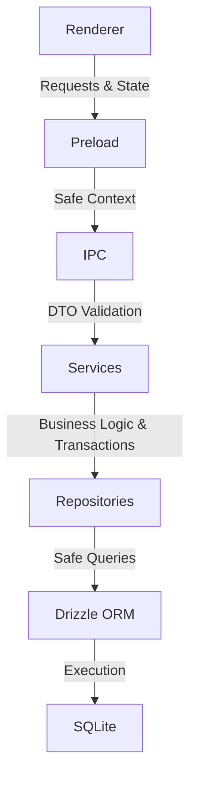
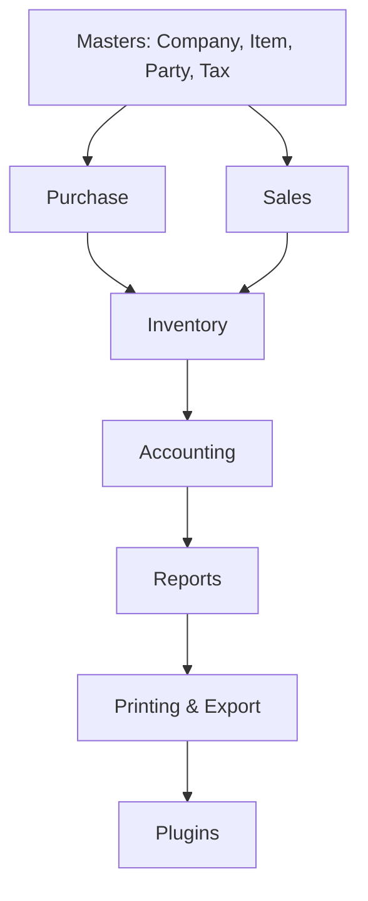

# Vyora ERP Master Development Blueprint v2.0

## Table of Contents

1. [Project Vision](#1-project-vision)
2. [Core Principles](#2-core-principles)
3. [Architecture](#3-architecture)
4. [Development Governance](#4-development-governance)
5. [Coding Standards](#5-coding-standards)
6. [Module Dependency Graph](#6-module-dependency-graph)
7. [Folder Structure Standards](#7-folder-structure-standards)
8. [Phase Roadmap](#8-phase-roadmap)
9. [Plugin Roadmap](#9-plugin-roadmap)
10. [Industry Editions](#10-industry-editions)
11. [Release Roadmap](#11-release-roadmap)
12. [Current Project Status](#12-current-project-status)
13. [July 15 Release Plan](#13-july-15-release-plan)
14. [Future Vision](#14-future-vision)
15. [Document Governance](#15-document-governance)
16. [Companion Documents](#16-companion-documents)

---

## 1. Project Vision

**Product Positioning**
Vyora ERP is an Offline-First Business Operating Platform.
Long-term competitors include: TallyPrime, Busy, Vyapar, Marg ERP, and Zoho.

**Why Vyora Exists**
Vyora ERP exists to empower businesses with an uncompromised, modern operating platform. The market is saturated with legacy systems that are slow, clunky, and tied to outdated architectures. Vyora brings speed, elegance, and enterprise-grade reliability to the fingertips of every business owner.

**Product Goals**

- Fast billing
- Modern UI
- Offline operation
- Enterprise reliability
- Cloud-ready
- Plugin extensibility

**Long-Term Mission**
To become the default operating system for small, medium, and enterprise businesses globally, managing everything from core accounting and inventory to advanced AI-driven workflows and multi-device cloud synchronisation.

**Offline-First Philosophy**
Business must never halt due to internet outages. Vyora ERP is fundamentally offline-first, relying on a high-performance local database for instant, zero-latency reads and writes, ensuring uninterrupted operations at the billing counter.

**Enterprise-First Philosophy**
Despite being accessible for small businesses, Vyora is built on enterprise foundations. Absolute data integrity is enforced via strict boundaries, repository layers, atomic transactions, and uncompromised type safety.

**Plugin-First Philosophy**
Vyora ERP is strictly modular. The core application remains lightweight and universally applicable. Advanced, localized, or industry-specific integrations (like GST, e-Way bills, banking) are relegated exclusively to a dynamic plugin architecture.

**UI Philosophy**

- Minimal
- Premium
- Fast
- Business-first
- Modern

**Performance Goals**

- Application startup: < 3 seconds
- Invoice save: < 500ms
- Report generation: < 2 seconds for 10,000 ledgers

**Backup Strategy**

- Local Backup: Encrypted automated daily backups.
- Cloud Backup: Secure Google Drive / cloud storage integrations.
- Future Sync: Real-time PostgreSQL cloud sync.

**Security Roadmap**

- Audit logs: Immutable history of all financial transactions.
- Encryption: Local database encryption at rest.
- Secure sync: JWT-based, TLS-encrypted data synchronization.
- Permission model: Role-based access control (RBAC).

**Ecosystem Vision**
Vyora is not just a desktop app. It is a unified ecosystem encompassing desktop nodes, a centralised cloud hub, a marketplace of plugins, and mobile companions acting as field agents.

**10-Year Vision**
Over the next decade, Vyora will evolve into a self-driving enterprise platform, where AI automates data entry, predicts inventory shortages, orchestrates cash flow, and provides real-time strategic intelligence.

---

## 2. Core Principles

The following principles are immutable and must govern all development:

- **Offline First**: The core application must function 100% without an internet connection.
- **Company Isolation**: Strict boundary protection. No cross-company data leakage is permitted. Queries must be scoped to the active company.
- **Financial Year Isolation**: Financial periods are strictly locked. Transactions cannot occur outside active periods.
- **Atomic Transactions**: Complete ACID compliance. Partial failures must fully rollback to maintain system integrity.
- **Deterministic Behaviour**: Same inputs must always yield the same outputs. No hidden side-effects.
- **Shared DTOs**: End-to-end type safety between the renderer, IPC, and services using shared Zod schemas.
- **Type Safety**: Strict TypeScript compilation with zero `any` usage.
- **Layer Separation**: Strict boundaries between UI, IPC, Services, and Repositories.
- **Service Purity**: Services must handle business logic only and never touch the database directly.
- **Repository Purity**: Repositories must handle data access only and contain no business logic.
- **InventoryEngine Authority**: Only the Inventory Engine may calculate stock quantities or WAC values.
- **InventoryReportService Ownership**: Only the designated reporting service handles complex report generation.
- **Plugin Extensibility**: Core features must not be polluted with integration logic; such logic belongs to plugins.
- **Simplicity Over Complexity**: If a solution is overly complex, it is wrong. Find the simpler path.
- **Performance First**: Millisecond response times at the point of sale are non-negotiable.
- **Backward Compatibility**: Updates must never break existing data or workflows.
- **Extensibility**: Build for tomorrow's plugins today.
- **Testability**: Code that cannot be tested automatically is considered broken.
- **Auditability**: Every financial and inventory change must leave an immutable audit trail.
- **Maintainability**: Write code for the developer who will read it 5 years from now.

---

## 3. Architecture

Vyora ERP implements a strict multi-tier architecture to enforce separation of concerns and maintain high performance and security.

### Architecture Flow Diagram

### Layer Responsibilities & Golden Rules

**Renderer**

- **Responsibility**: UI rendering, state management (Zustand), form handling, user interactions.
- **Golden Rule**: _Renderer NEVER accesses the database._
- **Forbidden**: Executing backend logic, using Node.js core modules, bypassing IPC.

**Preload**

- **Responsibility**: Acts as a secure, sandboxed bridge between the Renderer and Main process.
- **Golden Rule**: _Preload NEVER holds business logic._
- **Forbidden**: Exposing raw Electron/Node APIs.

**IPC (Inter-Process Communication)**

- **Responsibility**: Receives Renderer requests, validates incoming payloads against DTOs, and routes them to appropriate Services.
- **Golden Rule**: _IPC NEVER contains business logic._
- **Forbidden**: Directly querying Repositories, handling transactions.

**Services**

- **Responsibility**: Orchestrates business logic, enforces rules (Company/Financial Year Isolation), coordinates atomic transactions.
- **Golden Rule**: _Services NEVER expose raw SQL._
- **Forbidden**: Directly interacting with the file system (outside designated utils), executing ORM queries directly.

**Repositories**

- **Responsibility**: Abstracts database operations. Executes Drizzle ORM queries scoped safely to the active company context.
- **Golden Rule**: _Repositories NEVER calculate business rules._
- **Forbidden**: Coordinating multi-table transactions, returning raw un-typed data.

**Domain Authority**

- **InventoryEngine** exclusively owns valuation (WAC) and stock movement logic.
- **InventoryReportService** exclusively owns inventory reporting.

---

## 4. Development Governance

Every feature MUST follow the official workflow to ensure absolute quality.

### Definition of Done

A feature is **COMPLETE** only after the following checklist is fully satisfied:

- [ ] **Readiness Audit**: Ensure dependencies and core layers support the feature.
- [ ] **Implementation**: Build the feature adhering to Core Principles and Coding Standards.
- [ ] **Implementation Review**: Code review enforcing Layer Separation and Type Safety.
- [ ] **Runtime Certification**: Execute tests to ensure deterministic behaviour.
- [ ] **Reconciliation Audit**: Ensure UI matches the backend capabilities perfectly.
- [ ] **Git Readiness**: Verify no breaking changes or linting errors exist.
- [ ] **Atomic Commit**: Group changes logically into a single, cohesive commit.
- [ ] **Push**: Merge to active development branches.
- [ ] **Documentation Updated**: Update inline docs and developer guides as needed.
- [ ] **Blueprint Updated**: Update this Master Blueprint _only if_ the roadmap changes.

**No feature may bypass this workflow.**

---

## 5. Coding Standards

To maintain an enterprise-grade codebase, the following standards are strictly enforced:

- **No `any`**: The use of `any` is strictly prohibited. Use `unknown` if a type is truly dynamic, and narrow it with type guards.
- **Shared DTOs Only**: All communication between the frontend and backend must use explicitly defined Data Transfer Objects (DTOs).
- **Zod Validation**: Every external input, IPC payload, and form submission must be validated via Zod schemas.
- **Strict Typing**: TypeScript `strict` mode must be enabled and respected universally.
- **Service Purity**: Services must remain pure coordinators of logic. They do not fetch data directly; they ask Repositories.
- **Repository Purity**: Repositories map TypeScript objects to Database rows. Nothing more.
- **IPC Purity**: IPC handlers are strictly transport and validation layers.
- **Renderer Purity**: UI components render state. They do not mutate database state directly.
- **No SQL Outside Repositories**: Drizzle ORM queries must never leak into Services or the Renderer.
- **No Duplicated Business Logic**: If a rule exists, it exists in exactly one Service.
- **Offline-First By Default**: Assume there is no internet connection. Always write to local SQLite first.

---

## 6. Module Dependency Graph

Modules in Vyora must be built in a specific hierarchical order. A module higher in the chain cannot depend on a module lower in the chain.

**Why Dependency Order Matters:**
You cannot sell an item (Sales) that doesn't exist (Masters). You cannot calculate WAC (Inventory) without inbound cost (Purchase). You cannot generate a Trial Balance (Reports) without double-entry journals (Accounting). Strict adherence to this graph prevents circular dependencies and architectural collapse.

---

## 7. Folder Structure Standards

The project is structured as a monorepo. Responsibilities must remain strictly segregated.

- **`apps/desktop`**: Contains the Electron host, Main process (Backend), Preload script, and Renderer (Next.js frontend).
- **`apps/mobile`**: (Future) Contains the Flutter mobile companion app.
- **`apps/web`**: (Future) Contains the Cloud Hub dashboard.
- **`packages/database`**: The single source of truth for Drizzle schemas, migrations, and SQLite connection management.
- **`packages/types`**: Shared Zod schemas, DTOs, and TypeScript interfaces used across all apps.
- **`packages/ui`**: Shared React components (Shadcn), design tokens, and frontend utilities.
- **`plugins/`**: Isolated directory for Phase 9 external plugins. Plugins cannot import from `apps/`.
- **`docs/`**: Official project documentation, blueprints, and changelogs.
- **`scripts/`**: Build scripts, database seeders, and CI/CD automation tools.

---

## 8. Phase Roadmap

### Phase 0: Foundation

- **Purpose**: Establish project architecture and core tech stack.
- **Major Deliverables**: Electron setup, Next.js integration, Drizzle ORM, SQLite.
- **Dependencies**: None.
- **Exit Criteria**: Fully functioning IPC loop with typed DB read/write.

### Phase 1: Master Data

- **Purpose**: Core entity management foundational to all transactions.
- **Major Deliverables**: Company, Customer, Supplier, Item, Unit, Tax, Warehouse Masters.
- **Dependencies**: Phase 0.
- **Exit Criteria**: All masters CRUD operations verified; company and FY isolation enforced.

### Phase 2: Inventory Engine

- **Purpose**: Foundational stock movement and valuation mechanics.
- **Major Deliverables**: InventoryEngine, WAC calculations, Stock ledger backend.
- **Dependencies**: Phase 1.
- **Exit Criteria**: Accurate WAC calculation and robust stock movement logging.

### Phase 3: Accounting Engine

- **Purpose**: Double-entry journal and ledger systems.
- **Major Deliverables**: JournalService, VoucherService, System/Party Ledgers.
- **Dependencies**: Phase 1.
- **Exit Criteria**: Strict Cr/Dr balancing enforced globally; ledger groups mapped.

### Phase 4: Purchase

- **Purpose**: Inbound inventory and supplier accounting.
- **Major Deliverables**: Purchase forms, GRN, Purchase Returns, Debit Notes.
- **Dependencies**: Phase 2, Phase 3.
- **Exit Criteria**: Purchase workflow successfully updates inventory valuation and supplier ledgers.

### Phase 5: Sales

- **Purpose**: Outbound inventory and customer accounting.
- **Major Deliverables**: Sales Invoice, Drafts, Quotations, Sales Returns, Credit Notes.
- **Dependencies**: Phase 2, Phase 3.
- **Exit Criteria**: Invoice generation accurately affects WAC, stock levels, and party ledgers.

### Phase 6: Reporting

- **Purpose**: Business intelligence and compliance data surfacing.
- **Major Deliverables**: Stock Summary, Trial Balance, P&L, Balance Sheet, Day Book.
- **Dependencies**: Phase 4, Phase 5.
- **Exit Criteria**: Reports accurately and dynamically reflect atomic transaction data.

### Phase 7: Printing & Export

- **Purpose**: Physical and digital document generation.
- **Major Deliverables**: Invoice printing, PDF export, thermal printing support.
- **Dependencies**: Phase 5, Phase 6.
- **Exit Criteria**: High-quality, professional invoice and report rendering.

### Phase 8: Release Readiness

- **Purpose**: Final polish, stabilization, and QA for production.
- **Major Deliverables**: UI fixes, performance testing, deployment packaging.
- **Dependencies**: Phases 0-7.
- **Exit Criteria**: Zero critical bugs; complete July 15 Release Plan.

### Phase 9: Plugin Architecture

- **Purpose**: Extensibility for localized and industry-specific integrations.
- **Major Deliverables**: Plugin SDK, Registry, Loader, Manifest system.
- **Dependencies**: Phase 8.
- **Exit Criteria**: System can securely load and unload external plugins without core code changes.

### Phase 10: Advanced Inventory

- **Purpose**: Granular enterprise-grade inventory control.
- **Major Deliverables**: FIFO Ageing, Batch tracking, Serial numbers, Expiry management.
- **Dependencies**: Phase 5.
- **Exit Criteria**: Support for strict pharmaceutical and electronics tracking workflows.

### Phase 11: Business Expansion

- **Purpose**: End-to-end operational workflows.
- **Major Deliverables**: Orders, Estimates, Delivery Challans.
- **Dependencies**: Phase 5.
- **Exit Criteria**: Complete pre-sales to post-sales workflow conversion.

### Phase 12: Cloud Ecosystem

- **Purpose**: Multi-device synchronization and remote access.
- **Major Deliverables**: Cloud database (PostgreSQL), sync engine, background conflict resolution.
- **Dependencies**: Phase 8.
- **Exit Criteria**: Seamless local-to-cloud automated syncing without data loss or downtime.

### Phase 13: Mobile Ecosystem

- **Purpose**: Extension into field operations and handheld POS.
- **Major Deliverables**: Flutter mobile app, offline-first mobile billing.
- **Dependencies**: Phase 12.
- **Exit Criteria**: Mobile transactions sync accurately to the desktop/cloud master database.

### Phase 14: AI Ecosystem

- **Purpose**: Intelligent business automation.
- **Major Deliverables**: AI analytics, automated data entry assistance, OCR parsing.
- **Dependencies**: Phase 12.
- **Exit Criteria**: Actionable AI insights presented securely within the dashboard.

---

## 9. Plugin Roadmap

> [!IMPORTANT]  
> **Phase 9 is permanently RESERVED for Plugin Architecture.** Core application logic must never contain third-party integrations.

### Core Plugin Infrastructure

- **SDK**: Standardized, versioned API exposing safe Core services to plugins.
- **Registry**: Central store for managing installed, active, and available plugins.
- **Loader**: Secure, sandboxed execution engine (Node VM or similar) to prevent catastrophic crashes.
- **Manifest**: Standardized `plugin.json` declaring capabilities, entry points, and UI hooks.
- **Permissions**: Strict access control over core data (e.g., read-only ledgers, blocked deletions).
- **Versioning**: Safe update, rollback, and API deprecation mechanisms.
- **Lifecycle**: Install, Enable, Disable, Uninstall hooks.
- **Dependency Resolution**: Prevent conflicts when multiple plugins interact.

### Plugin Categories & Planned Integrations

**Government & Compliance**

- GST Filing Automation
- E-Invoice Generation
- E-Way Bill Integration

**Communication**

- WhatsApp (Invoices, Reminders)
- SMS (Alerts, OTPs)
- Email (Automated Statements)

**Payments & Finance**

- Banking Integration (Auto-reconciliation)
- UPI QR Generation
- Payment Gateway Links

**Hardware**

- Barcode Scanner Optimization
- QR Scanner Support
- Thermal Printer Raw Protocols
- Label Printer Formatting

**Industry-Specific Overlays**

- Manufacturing (Bill of Materials)
- Pharmacy (Drug interactions, Schedule H tracking)
- Restaurant (Table management, KOT)
- Dairy (Fat percentage tracking)
- Jewellery (Karat tracking, making charges)
- Textile (Size/Color matrix)
- Steel (Weight/Length conversions)

---

## 10. Industry Editions

Vyora's core architecture combined with the Phase 9 Plugin Ecosystem allows for highly specialized Industry Editions. These will be marketed and deployed as tailored experiences:

- **Vyora Retail**: High-speed POS, barcode focus, loyalty programs.
- **Vyora Pharma**: Batch/Expiry tracking, scheduled drug compliance.
- **Vyora Restaurant**: Table management, Kitchen Order Tickets (KOT), recipe management.
- **Vyora Dairy**: Specialized volume/fat percentage calculations, route sales.
- **Vyora Manufacturing**: Bill of Materials (BOM), production cycles, raw material conversion.
- **Vyora Textile**: Matrix inventory (Size/Color/Fit), bulk piece tracking.
- **Vyora Steel**: Dual-unit tracking (Pieces + Weight), specific taxation rules.
- **Vyora Jewellery**: Metal purity tracking, fluctuating daily rates, making charge calculations.

---

## 11. Release Roadmap

- **v1.0**: Core ERP (Foundation, Offline Billing, WAC Inventory, Double-Entry Accounting) + Plugin Framework + GST Plugin v1
- **v1.1**: GST Plugin Enhancements & Tax Reporting
- **v1.2**: Deep Compliance (Audit locks, rigorous trail tracking)
- **v1.3**: Communication (WhatsApp, SMS, Email integrations)
- **v1.4**: Hardware integrations (Advanced Printing, Scanners)
- **v2.0**: Cloud Sync Engine & Multi-device Support
- **v2.5**: Official Plugin Marketplace Launch
- **v3.0**: AI Ecosystem (Predictive analytics, OCR)
- **v4.0**: True Enterprise (Multi-branch, complex approvals, consolidated accounting)

---

## 12. Current Project Status

- ✅ **Architecture**
- ✅ **Core Masters**
- 🟡 **Purchase**
- 🟡 **Sales**
- 🟡 **Inventory**
- 🟡 **Accounting**
- 🟡 **Reporting**
- 🟡 **Printing**
- 🔵 **Plugin System**
- 🟡 **QA**
- 🟡 **Release**

_Status Legend:_
✅ Complete | 🟢 Release Ready | 🟡 In Progress | 🔵 Planned | ⚪ Future | ⏸ Deferred | ❓ Needs Verification

---

## 13. July 15 Release Plan

### MUST COMPLETE

- Full Sales Invoice lifecycle (Submit, Edit, Delete, Print)
- Core Financial Reports (Trial Balance, P&L, Balance Sheet)
- Essential Ledger UI (Day Book, Cash Book, Outstanding)
- Basic Invoice Print Engine
- Plugin Framework Foundation
- GST Plugin v1
- Robust QA and Runtime Certification

### SHOULD COMPLETE

- Inventory Reports (Stock Summary, Valuation)
- Purchase Returns finalize workflow
- User/Role Permissions

### CAN WAIT (AFTER v1.0)

- Cloud Sync Engine
- Mobile Ecosystem
- Advanced Inventory (FIFO, Batch, Serial, Expiry)
- E-Invoicing / E-Way Bill integrations

---

## 14. Future Vision

Vyora ERP is destined to scale far beyond a simple billing tool.

- **Desktop Resilience**: The desktop app remains the indestructible, offline-first anchor for all business locations.
- **Cloud Centralization**: A powerful PostgreSQL backend synchronizing data across multiple physical stores instantly.
- **Hybrid Harmony**: The speed of desktop combined with the accessibility of the cloud.
- **Marketplace Growth**: A thriving ecosystem where independent developers build and monetize Vyora plugins.
- **Multi-device Fluidity**: Start an invoice on a PC, complete it on a tablet, view the report on a phone.
- **Flutter Mobile**: Empower field agents with lightweight, offline-capable mobile sales apps.
- **AI & Business Intelligence**: Shifting from data _storage_ to data _insight_.
- **Analytics Engine**: Beautiful, actionable enterprise-grade dashboards.
- **OCR & Voice AI**: Scan a physical supplier bill or dictate an expense, and watch Vyora create the voucher automatically.
- **Workflow Automation**: "If stock drops below X, automatically email supplier Y with a Purchase Order."

---

## 15. Document Governance

**This document is the constitutional document of Vyora ERP.**

- It should change **rarely**.
- Roadmap changes must be highly **intentional** and debated.
- The Architectural Principles defined here are **immutable**.
- Phase 9 is **permanently reserved** for Plugin Architecture.

_No feature, module, or developer is exempt from these governance rules._

---

## 16. Companion Documents

To keep this blueprint timeless, ephemeral or highly detailed tracking is delegated to companion documents:

- **`VYORA_PROJECT_STATUS.md`**
  - Tracks Current Sprint & Phase
  - Lists Completed/Pending phases
  - Details Release Readiness and Known Issues
  - Acts as the operational Release Checklist

- **`VYORA_CHANGELOG.md`**
  - Records Version History
  - Highlights Major Milestones
  - Provides detailed Release Notes
  - Documents any Breaking Changes

---

**Last Updated**: 2026-07-06  
**Purpose**: Authoritative ERP Roadmap & Constitution  
**Update Frequency**: Only on architectural or strategic shifts  
**Owner**: Epexio Techno Solutions Core Team
