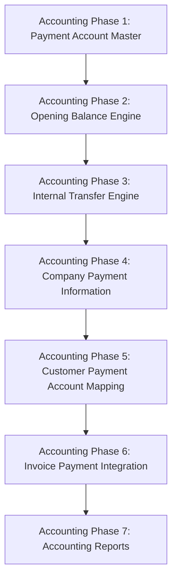

# Accounting Phase Roadmap

## Authoritative Accounting System Objective
We are building a complete company payment-account and invoice-payment ecosystem.
The overall accounting/payment architecture must support:
1. Company-level Payment Accounts
2. Opening Balance / Opening Ledger integration
3. Internal Fund Transfers
4. Company-level Payment Information
5. Customer-level Payment Account Preferences
6. Invoice Payment Information + Dynamic QR
7. Accounting Reports

## Accounting System Dependency Graph

## Implemented vs Planned Status

| Phase | Description | Status |
|---|---|---|
| **Accounting Phase 1** | Payment Account Master | 🟢 IMPLEMENTED / AUDITED / COMPLETED |
| **Accounting Phase 2** | Opening Balance Engine | 🟢 IMPLEMENTED / AUDITED / COMPLETED |
| **Accounting Phase 3** | Internal Transfer Engine | 🟢 IMPLEMENTED / AUDITED / COMPLETED |
| **Accounting Phase 4** | Company Profile Payment Information | 🟢 IMPLEMENTED / AUDITED / COMPLETED |
| **Accounting Phase 5** | Customer Default Account Mapping | 🟢 IMPLEMENTED / AUDITED / COMPLETED |
| **Accounting Phase 6** | Invoice Engine Payment Integration | 🟢 IMPLEMENTED / AUDITED / COMPLETED |
| **Accounting Phase 7** | Accounting Reporting | ⚪ NOT STARTED |

---

## Accounting Phase 1 — Payment Account Master
**Goal**: Create the foundation for company-level payment accounts.
**Supported account types**: BANK, CASH, UPI

Company-level payment accounts must support:
- Name
- Account type
- Opening balance
- Opening date
- Active/inactive flag
- Default flag
- Display order

**PaymentAccount intended structure**:
`id`, `companyId`, `name`, `type`, `bankName`, `accountHolderName`, `accountNumber`, `ifscCode`, `branchName`, `upiId`, `openingBalance`, `openingDate`, `isDefault`, `isActive`, `sortOrder`, `createdAt`, `updatedAt`

**Core rules**:
- One default BANK account
- One default CASH account
- One default UPI account

**Phase 1 responsibilities**:
- Database schema, AccountType, PaymentAccount repository, PaymentAccount service, DTOs, Validation, IPC, Company isolation, Account activation/deactivation, Default-account rules, Display ordering, Account master UI.
*(Do not mix opening-balance accounting logic into Phase 1 unless already required by the existing implementation.)*

## Accounting Phase 2 — Opening Balance Engine
**Status**: 🟢 Audited & Completed
**Goal**: Integrate Payment Accounts with the accounting ledger.
Opening balances must become real accounting transactions rather than merely stored metadata.

**Opening voucher type**: `ACCOUNT_OPENING`
**Example**: 
Bank A (Dr)
Opening Bal (Cr)

**Required validation**:
- Duplicate opening prevention
- Financial year validation
- Locked financial year validation
- Company isolation
- Transaction atomicity
- Correct double-entry balance
- Opening balance amount < 0 → REJECT.
- Opening balance amount = 0 → VALID (Zero is an explicit accounting state and must create a balanced 0/0 voucher).
- Opening balance amount > 0 → VALID.

Opening balances must integrate with the existing JournalService/accounting engine. Opening balances must remain distinguishable from normal transactions.
**Important existing architectural rule**: Payment-account deletion logic must treat opening transactions differently from normal transactions. The existing reversal lifecycle must also work for a zero opening balance.

## Accounting Phase 3 — Internal Transfer Engine
**Status**: 🟢 Audited & Completed
**Goal**: Move funds between company Payment Accounts.
**Voucher/reference classification**: `FUND_TRANSFER`

**Supported flows**:
`BANK_TO_BANK`, `BANK_TO_CASH`, `CASH_TO_BANK`, `BANK_TO_UPI`, `UPI_TO_BANK`, `CASH_TO_UPI`, `UPI_TO_CASH`

Every transfer must create a balanced double-entry journal.
**Accounting rules**:
- Source account is credited, Destination account is debited
- Exactly two ledger entries, No third ledger
- Voucher must remain balanced
- Financial year validation, Locked FY validation
- Company isolation
- Source/destination must exist, Both accounts must be active, Source != destination
- Amount > 0
- Transaction must be atomic
- Cancellation must be a reversal, not a hard delete, Edit must preserve auditability

**Architectural Rules**:
- Fund Transfer receives its own server-generated `fundTransferId`, stored as `voucher.referenceId`.
- `FundTransferRepository` exposes `referenceId` as the domain ID.
- Update/reversal resolve the voucher through `referenceId`.
- `referenceNumber` is a human-facing value, preserved through voucher narration.

## Accounting Phase 4 — Company Profile Payment Information
**Status**: 🟢 Audited & Completed
**Goal**: Store company-wide payment information that will later be consumed by the Invoice Engine.

Fields stored directly on the `companies` table:
`defaultUpiId`, `upiPayeeName`, `showQrOnInvoice` (default `false`), `showBankDetailsOnInvoice` (default `false`)

**Architecture**:
CompanyProfileShell → UpdateCompanyProfileRequest → CompanyContextService → CompanyRepository → companies table

**Important Phase Boundary**:
Accounting Phase 4 ONLY stores company payment configuration. It does NOT implement QR generation, Invoice rendering, Invoice PDF generation, Customer-specific payment-account selection, or Invoice payment-account selection.

## Accounting Phase 5 — Customer Default Account Mapping
**Status**: 🟢 IMPLEMENTED / AUDITED / COMPLETED
**Goal**: Allow each customer to define their preferred payment destination.

**Customer-level fields**:
`defaultPaymentAccountId`, `defaultQrAccountId` (Both optional)

`defaultPaymentAccountId` = account/payment destination used for normal invoice payment information.
`defaultQrAccountId` = payment account used when generating invoice QR information.

**Selection hierarchy**:
Customer account → Company default account → Fallback account. (The exact definition of "fallback account" must be established from the current accounting architecture before implementation).

## Accounting Phase 6 — Invoice Engine Payment Integration
**Goal**: Consume the payment-account and company payment information architecture when generating invoices.
**Invoice payment section may include**:
Bank name, Account number, IFSC, Branch, UPI ID, QR code (Dynamic).

**QR generation rules**:
- Amount dynamically generated from invoice.
- Responds to `showQrOnInvoice` and `showBankDetailsOnInvoice` logic (Phase 4).
- Respects account selection hierarchy from Phase 5.

Accounting Phase 6 must NOT create a competing payment-account architecture.

## Accounting Phase 7 — Accounting Reporting
**Goal**: Provide reporting over company payment accounts and internal movements.
**Required reports**: Bank Book, Cash Book, UPI Book, Transfer Register, Account Balance Summary.

Reports must use the actual accounting ledger as the source of truth, respecting company isolation, financial year, cancellation/reversal semantics, opening balances, fund transfers, and account activity.

---

## Cross-Phase Accounting Architectural Rules
These rules apply to ALL Accounting Phases:
1. **Ledger is the accounting source of truth**: PaymentAccount metadata is not itself the accounting ledger. Actual financial movements must be represented through JournalService / voucher entries.
2. **Double-entry accounting**: Every financial transaction must balance. Debit total = Credit total.
3. **Company isolation**: No accounting operation may cross company boundaries.
4. **Financial year enforcement**: Accounting transactions must respect the active financial year.
5. **Locked FY enforcement**: Locked financial years must reject modifications.
6. **Reversal instead of hard delete**: Accounting transactions must remain auditable. Cancellation/reversal should create the appropriate reversal entry rather than deleting historical accounting records.
7. **Transaction atomicity**: Multi-step accounting operations must be atomic. No partial voucher/entry state should remain after failure.
8. **Payment Account lifecycle**: Inactive accounts must not be selectable for new accounting transactions. Accounts with accounting history must not be hard-deleted where the accounting architecture prohibits deletion. Opening-balance transactions must remain distinguishable from normal accounting transactions.
9. **Canonical domain identity**: When a virtual accounting entity has no standalone table, its canonical domain ID must be explicitly represented through `voucher.referenceId` rather than exposing `voucher.id` as the domain identity.
10. **Existing architecture first**: Follow established project patterns (e.g. `JournalService`, `SalesInvoice`, `PurchaseBill`, `PaymentAccount`) before introducing a new pattern.
11. **No premature downstream implementation**: Respect phase boundaries. Do not implement downstream functionality prematurely.
12. **Zero-Amount Vouchers**: A zero opening balance (and similar specific states) is an explicit accounting state. It must create a valid balanced 0/0 voucher entry. Zero must not be interpreted as "no opening balance" and must be reversible using the standard reversal lifecycle.
